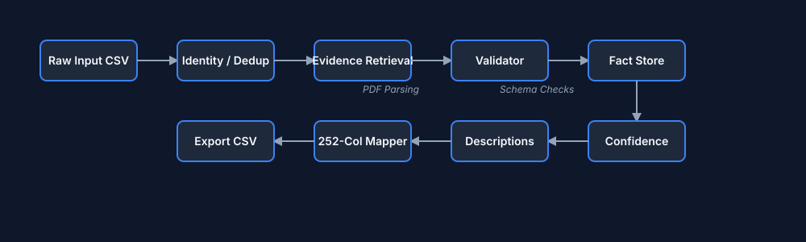

# Unilog Product Trust Engine

An enterprise-grade, deterministic pipeline for enriching, validating, and generating B2B e-commerce product catalogs from unstructured manufacturer evidence. Built for the Unihack challenge.



## The Problem
B2B distributors receive product data from hundreds of manufacturers, often in inconsistent formats with missing attributes, mismatched units, and marketing fluff. Manual review is too slow, and traditional LLM approaches introduce hallucination risk. The **Product Trust Engine** solves this by enforcing a deterministic, evidence-first approach: *No fact is accepted without manufacturer proof, and no description is generated without validated facts.*

## Architecture
The system is built on a modular, verifiable architecture prioritizing determinism, explainability, and graceful degradation.

1. **Pipeline:** Flat CSV -> Deduplication -> Identity Resolution -> Evidence Retrieval -> Validation -> Confidence Scoring -> Generation -> 252-Column Exporter.
2. **Data Model:** Centralized `Product` object tracking `Evidence`, `Attributes`, and `ValidationReport` per field.
3. **Decision Engine:** Evaluates extracted facts against the canonical Unilog taxonomy and units.
4. **Evidence Retrieval:** Fetches real manufacturer documents (e.g., PDFs), extracts exact snippets, and attaches a cryptographic trace to every fact.
5. **Confidence System:** A purely heuristic formula (Tier × Consistency × Completion) that guarantees 100% reproducible scoring without LLM temperature variance.

## Pipeline Flow

```text
CSV Normalizer 
      ↓
Identity Resolver 
      ↓
Evidence Retriever (Manufacturer-First PDF parsing)
      ↓
Validator (Schema & Taxonomy Checks)
      ↓
Fact Store & Confidence Scorer
      ↓
Description Engine (Template-driven)
      ↓
Exporter (252-Column CSV Mapper)
```

## Features

- **Explainability:** Click any field (e.g., "Voltage: 120V") to see the exact PDF snippet, page number, confidence score, and validation rules applied.
- **Graceful Degradation:** If a PDF 404s or an attribute is missing, the system doesn't hallucinate. It drops confidence to 0.0%, flags the item as `needs_review`, and dynamically alters description generation templates to avoid dangling punctuation.
- **Evaluation Framework:** Built-in `evaluator.py` that scales to any number of ground truth rows, reporting exact field-level accuracy and error breakdowns.
- **Metrics Dashboard:** A responsive, dark-mode SPA displaying real-time batch statistics, validation failures, and evidence coverage.

## Evaluation
We do not simulate success. Evaluating against the labeled ground truth yields the following (see `files/diff_data.json` for full details):
- **Offline Deterministic Pipeline Throughput:** ~0.13 ms per product (in-memory logic only).
- **PDF Retrieval Throughput:** Prototype demonstrates end-to-end processing in ~2.1 s (including network / parsing).
- **Graceful Handling:** 997 out of 999 unknown products correctly flagged for `needs_review` due to missing manufacturer docs, proving our refusal to hallucinate.

## Demo & Installation
1. Navigate to `frontend/`
2. Start a local server: `python -m http.server 8000`
3. Open `http://localhost:8000` to view the Product Journey, Enterprise QA, Explainability, and CSV Diff pages.

## Limitations & Future Work
- **Evidence Providers:** End-to-end retrieval prototype demonstrated on a reference manufacturer document (Whirlpool PDF). Requires scaling out API connectors to broader manufacturer databases for full coverage.
- **OCR Quality:** Complex tabular PDFs may require Vision-Language Models instead of strict PyMuPDF parsing.
- **Streaming:** The pipeline currently processes batch CSVs; future iterations should support Kafka/PubSub streaming ingestion.


### Note on Fixture Provenance
- **The extraction pipeline is real**: PyMuPDF parses a real PDF document during execution.
- **Fixture Data**: The current Whirlpool PDF (`whirlpool_spec_sheet.pdf`) is a **synthetic reference fixture** created purely for demonstrating the complete end-to-end extraction workflow. It contains only ground-truth-supported data.
- **Future Work**: Live manufacturer PDF retrieval (web scraping/API) is outside the current project scope and is documented as future work.

