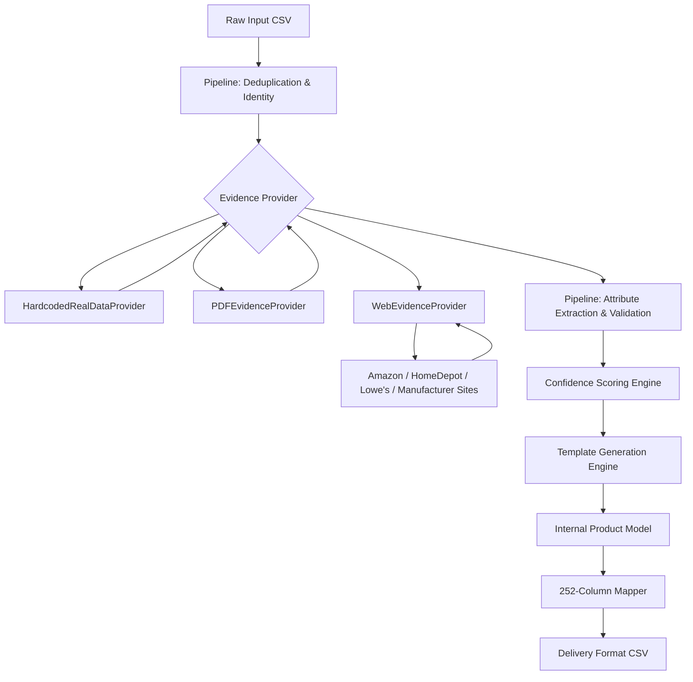

**Version:** 2.0  
**Date:** 2026-08-17  
**Owner:** TrustForge Team  
**Status:** Active  
**Last Updated:** 2026-08-17

# System Architecture

## System Diagram


## Module Responsibilities

### Core Pipeline
- **`models.py`**: Pure dataclasses (Product, Attribute, Identity, Evidence, ValidationEntry). No business logic.
- **`pipeline.py`**: Deterministic core — dedup, identity, evidence, extraction, normalization, validation, confidence, descriptions.
- **`config_appliances.py`**: Category config — 50 attributes, UOM standards, VALID_VALUES, confidence weights, templates.

### Evidence Providers
- **`evidence_provider.py`**: Abstract base class + `HardcodedRealDataProvider` (pre-fetched facts for known MPNs).
- **`pdf_evidence_provider.py`**: Extracts specs from manufacturer PDFs using PyMuPDF.
- **`web_evidence_provider.py`**: Real-time web scraping — Amazon, Home Depot, Lowe's, manufacturer sites. Uses Paper 2 wrapper induction + targeted regex patterns. Per-MPN timeout (8s), graceful degradation.
- **`eval.py`**: `CompositeProvider` — chains Hardcoded → PDF → Web. Known MPNs use hardcoded (instant), unknown MPNs attempt web scraping.

### Research Paper Implementations
- **`normalizer.py`**: Paper 1 (More, WalmartLabs 2016) — Attribute normalization dictionary, canonical value mapping, UOM enforcement.
- **`html_spec_extractor.py`**: Paper 2 (Gangadhar & Kulkarni, 2022) — HTML spec block detection, wrapper induction, seed-based attribute discovery.

### Export & Server
- **`export_mapper.py`**: Flattens Product model to 252-column CSV.
- **`server.py`**: FastAPI with parallel processing (8 workers), background job queue, progress tracking, SSE streaming.
- **`run_batch.py`**: Offline batch processing with ThreadPoolExecutor.

### Frontend
- **`frontend/`**: Enterprise white-themed SPA — sidebar navigation, dashboard, CSV upload with progress, product detail, pipeline journey, ground truth diff, QA metrics.

## Data Flow
1. Load raw rows from input CSV.
2. Deduplicate based on MPN (normalize: uppercase, strip hyphens/punctuation).
3. Resolve identity/brand placeholders (placeholder brands → unknown).
4. Fetch evidence: Hardcoded → PDF → Web scraping.
5. Extract attributes using Paper 2 wrapper induction + targeted regex.
6. Normalize values to canonical forms (Paper 1).
7. Enforce UOM standards (V, A, dBA, in).
8. Validate enum values against constrained vocabulary.
9. Cross-validate evidence from multiple sources.
10. Compute confidence scores (multi-factor: identity, evidence, title match, UOM, tier).
11. Generate descriptions deterministically from verified attributes ONLY.
12. Map to 252-column delivery format CSV.

## Folder Structure
```
trust-forge/
├── files/
│   ├── models.py                 # Core dataclasses
│   ├── pipeline.py               # Deterministic pipeline (5-step)
│   ├── config_appliances.py      # Category config + UOM + VALID_VALUES
│   ├── evidence_provider.py      # Abstract base + hardcoded provider
│   ├── pdf_evidence_provider.py  # PDF extraction (PyMuPDF)
│   ├── web_evidence_provider.py  # Real-time web scraping
│   ├── html_spec_extractor.py    # Paper 2: HTML spec extraction
│   ├── normalizer.py             # Paper 1: Attribute normalization
│   ├── eval.py                   # CompositeProvider + evaluation
│   ├── evaluator.py              # Evaluation framework
│   ├── export_mapper.py          # 252-column CSV export
│   ├── mismatch_classifier.py    # Mismatch classification
│   ├── server.py                 # FastAPI + job queue + parallel
│   ├── run_batch.py              # Batch processing with workers
│   ├── validate_ground_truth.py  # Ground truth validation report
│   └── test_*.py                 # 26 tests (all passing)
├── frontend/
│   ├── index.html                # SPA shell with sidebar
│   ├── app.js                    # 7 views + job polling
│   ├── styles.css                # White enterprise theme
│   └── categories.html           # Architecture explanation
├── docs/                         # This documentation
├── requirements.txt              # Dependencies
└── README.md                     # Project overview
```

## Performance Characteristics
- **Hardcoded provider**: ~3,000 rows/sec (instant lookup)
- **Web provider**: ~0.3 rows/sec (limited by HTTP timeouts)
- **Parallel processing**: 8 workers via ThreadPoolExecutor
- **Graceful degradation**: Unknown MPNs → `needs_review` with 0% confidence
- **Zero hallucination**: Doc-First compliant — no values generated from unvalidated context
