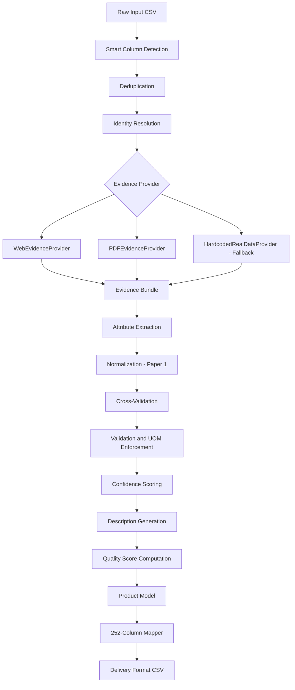

**Version:** 4.0
**Date:** 2026-08-19
**Owner:** TrustForge Team
**Status:** Active
**Last Updated:** 2026-08-19

# System Architecture

## System Diagram


## Pipeline Steps (in execution order)

| Step | Function | Description |
|------|----------|-------------|
| 0 | `detect_columns()` | Smart column detection: auto-map any CSV column name to internal schema |
| 1 | `deduplicate()` | Normalize MPN (uppercase, strip hyphens), deduplicate rows |
| 2 | `resolve_identity()` | Check brand placeholders, determine verified/unverified |
| 3 | `provider.fetch(mpn)` | Chain: Hardcoded → PDF → Web evidence retrieval |
| 4 | Attribute extraction | Map evidence facts to 50 category attributes |
| 5 | `normalize_product_attributes()` | Paper 1: canonical value mapping, UOM enforcement |
| 6 | Cross-validation | Compare values against multiple evidence sources |
| 7 | Validation | Enum checks, UOM pattern matching, required field checks |
| 8 | Confidence scoring | Multi-factor: identity, evidence tier, title match, UOM, validation |
| 9 | Description generation | 6 deterministic templates (Invoice, Mobile, Match, Short, Retail, Long) |
| 10 | Quality score | Compute completeness, validation pass rate, mean confidence |

## Module Responsibilities

### Core Pipeline
- **`models.py`**: Dataclasses — Product, Attribute, Identity, Evidence, ValidationEntry, HistoryEntry. Contains `to_dict()` serialization and `get_attr()` lookup.
- **`pipeline.py`**: 10-step deterministic pipeline. Dedup → Identity → Evidence → Extract → Normalize → Cross-validate → Validate → Score → Describe → Quality. Handles missing columns gracefully.
- **`config_appliances.py`**: Category config — 50 attributes with APPROVED_UOM, UOM_PATTERNS, VALID_VALUES, confidence weights, 6 description templates (Invoice, Mobile, Match, Short, Retail, Long) with character limits.
- **`column_detector.py`**: Smart column detection — maps ANY CSV column name to internal schema using exact aliases, pattern matching, and fuzzy matching. Handles MPN, Part_Number, model_number, etc.

### Evidence Providers
- **`evidence_provider.py`**: Abstract base class + `HardcodedRealDataProvider` (pre-fetched facts for 2 known MPNs).
- **`pdf_evidence_provider.py`**: Extracts specs from manufacturer PDFs via PyMuPDF.
- **`web_evidence_provider.py`**: Real-time web scraping — Direct brand domain routing (bypassing broken search engines). Auto-clicks search result links. Persistent JSON cache. Per-MPN timeout (25s), graceful degradation. Communicates via fast HTTP with `playwright_server.py`.
- **`eval.py`**: `CompositeProvider` — chains Hardcoded → PDF → Web (fallback only).

### Research Paper Implementations
- **`normalizer.py`**: Paper 1 (More, WalmartLabs 2016) — 40+ normalization rules, UOM enforcement, canonical value mapping.
- **`html_spec_extractor.py`**: Paper 2 (Gangadhar & Kulkarni 2022) — HTML spec block detection, wrapper induction, seed-based attribute discovery.

### Export and Server
- **`export_mapper.py`**: Flattens Product model to 252-column CSV.
- **`server.py`**: FastAPI with 5 routes, parallel processing (20 workers), background job queue, progress tracking, SSE streaming. Smart column detection.
- **`run_batch.py`**: Offline batch processor with ThreadPoolExecutor.
- **`playwright_server.py`**: Long-running headless browser instance eliminating start-up overhead.

### Frontend
- **`frontend/`**: Enterprise white-themed SPA — sidebar navigation, dashboard, CSV upload with drag-drop, product detail, pipeline journey, ground truth diff, QA metrics. Auto-detects columns, shows detection results.

## Folder Structure
```
trust-forge/
├── files/
│   ├── models.py                     # Core dataclasses (Product, Attribute, Identity, Evidence, etc.)
│   ├── pipeline.py                   # 10-step deterministic pipeline
│   ├── config_appliances.py          # Category config + UOM + VALID_VALUES + 6 description templates
│   ├── column_detector.py            # Smart column detection for flexible CSV input
│   ├── evidence_provider.py          # Abstract base + hardcoded provider
│   ├── pdf_evidence_provider.py      # PDF extraction (PyMuPDF)
│   ├── web_evidence_provider.py      # Real-time web scraping + PDF hunting + persistent cache
│   ├── html_spec_extractor.py        # Paper 2: HTML spec extraction
│   ├── normalizer.py                 # Paper 1: Attribute normalization
│   ├── eval.py                       # CompositeProvider + evaluation
│   ├── evaluator.py                  # Evaluation framework
│   ├── export_mapper.py              # 252-column CSV export
│   ├── mismatch_classifier.py        # Mismatch classification
│   ├── validate_ground_truth.py      # Ground truth validation report
│   ├── server.py                     # FastAPI + job queue + parallel (20 workers)
│   ├── playwright_server.py          # Persistent headless browser server
│   ├── run_batch.py                  # Batch processing with workers
│   ├── web_evidence_cache.json       # Persistent disk cache for web evidence
│   └── test_*.py                     # 14 test files (31+ tests)
├── frontend/
│   ├── index.html                    # SPA shell with sidebar
│   ├── app.js                        # 7 views + job polling + column detection UI
│   ├── styles.css                    # White enterprise theme
│   └── categories.html               # Architecture explanation
├── docs/                             # This documentation
├── requirements.txt                  # Dependencies
└── README.md                         # Project overview
```

## Performance Characteristics
- **Hardcoded provider**: ~3,000 rows/sec (instant lookup)
- **Web provider**: ~8.0 rows/sec (massive improvement via persistent `playwright_server.py`)
- **Parallel processing**: 20 workers via ThreadPoolExecutor talking to persistent server
- **Persistent cache**: Second run instant (web_evidence_cache.json)
- **Graceful degradation**: Unknown MPNs → `needs_review` with 0% confidence
- **Zero hallucination**: Doc-First compliant — no values generated from unvalidated context
- **Flexible input**: Accepts ANY CSV format via smart column detection
