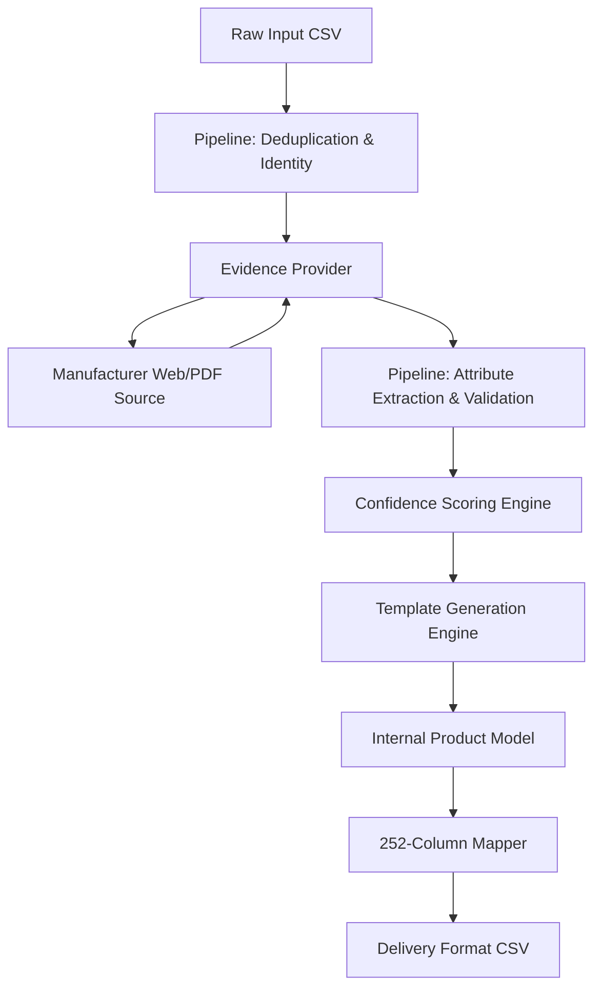

**Version:** 1.1  
**Date:** 2026-08-14  
**Owner:** AI Pipeline  
**Status:** Active  
**Reviewed By:** User  
**Last Updated:** 2026-08-14  

# System Architecture

## System Diagram


## Module Responsibilities

- **`models.py`**: Pure dataclasses representing the internal state of a Product, its Attributes, Evidence, and Validation checks. Contains no business logic or I/O.
- **`pipeline.py`**: The deterministic core. Handles deduplication, identity resolution, invoking evidence retrieval, running validation checks, confidence scoring, and rendering descriptions.
- **`evidence_provider.py`**: Abstraction layer for fetching external facts. Hides the complexity of web scraping and LLM extraction from the pipeline.
- **`config_appliances.py`**: Category-specific configuration. Defines attributes, required fields, unit of measure (UOM), confidence weights, and description templates.
- **`eval.py`**: Evaluation harness to compare pipeline outputs against ground truth data.

## Data Flow
1. Load raw rows from input CSV.
2. Deduplicate based on MPN.
3. Resolve identity/brand placeholders.
4. Fetch evidence using `EvidenceProvider`.
5. Map evidence to predefined `Attributes` (from config).
6. Validate attributes and compute confidence scores.
7. Render textual descriptions from validated attributes ONLY.
8. Store in canonical `Product` model.
9. Map `Product` model to 252-column delivery format CSV.

## Folder Structure
```
.
├── docs/                   # ADRs, Tech Debt, Status, Architecture, Data Model, API
├── files/
│   ├── config_*.py         # Category configurations
│   ├── eval.py             # Evaluation scripts
│   ├── evidence_provider.py# External retrieval abstraction
│   ├── models.py           # Core dataclasses
│   └── pipeline.py         # Main deterministic pipeline
├── Unihack_ Expected Output - Delivery Format.csv
└── Unihack_ Sample Dataset - Input.csv
```

## Non-Goals
- Real-time/streaming processing (Batch only).
- Generating descriptions prior to validation.
- Orchestrating multiple LLM agents (strictly deterministic code with single-shot extraction).
- Persisting state in a relational database (Stateless / JSON / CSV only).
